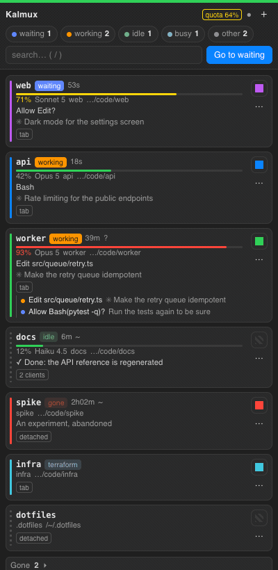

<h1 align="center">Kalmux</h1>

<p align="center">
<b>Ten Claude Code agents in tmux, one place to watch them all.</b><br> A thin management layer that lives inside iTerm2 instead of replacing your terminal.
</p>

<p align="center">


</p>

<p align="center"></p>

<p align="center"><sub>An agent stops for you, its card turns amber and jumps to the top; one click and you are in that tab. Recorded from the bundled mock server.</sub></p>

<p align="center"><a href="README.vi.md">Tiếng Việt</a></p>

---

## Why Kalera built this

A working day at [Kalera AI](https://www.kalera.ai) looks like four to ten tmux sessions, each running a Claude Code agent, each in a different repository. The agents are fast. The human is the bottleneck: one of them is waiting for an answer, one has been grinding for twenty minutes, one finished ten minutes ago and nobody noticed, and one is about to run out of context.

iTerm2 3.7 ships a Claude Code integration that answers exactly this question, and it breaks under tmux. Every pane inside a tmux server inherits the same `ITERM_SESSION_ID`, so every agent reports its state to one hidden gateway tab. The Session Status tool and Cockpit end up empty while ten agents work behind them.

Kalmux fixes the routing and then builds the missing dashboard on top of it. Nothing is replaced:

| Layer           | Stays what it is                                                            |
| --------------- | --------------------------------------------------------------------------- |
| **tmux**        | the server, so SSH and Tailscale keep working from any device               |
| **iTerm2**      | the desk client: control mode `tmux -CC`, native tabs, Cockpit, toolbelt    |
| **Claude Code** | untouched; Kalmux reads its hooks, its session registry and its status line |

Three small pieces do the work: a hook wrapper, the `kalmux` CLI, and a web UI served on `127.0.0.1:47321` that iTerm2 shows in its toolbelt.

## What you get

**One card per session, sorted by who needs you.** Waiting first, then working, idle, busy. Click a card to jump to its iTerm2 tab; if the session has no tab, one opens in the window you are in.

**A context gauge on every card.** The percentage comes straight from Claude Code's own status-line payload, so you can see which agent is about to compact before you hand it a long prompt. The card also carries the model and the session cost, and the header shows the five-hour quota window when your plan reports one.

**A `Gone` section that brings sessions back.** On 14 September 2026 an agent tidying up its own sandbox ran `tmux kill-server`. The session it ran in was itself inside tmux, so `$TMUX` pointed at the real server: four sessions, every tab, and hours of work went away in one command. Kalmux now writes a small trail for every Claude session (its id, folder, tmux pane and identity color). When a session dies, its card moves to `Gone` with a **Resume** button that recreates the tmux session in the right folder with the right color and types `claude --resume <id>` at the prompt, waiting for your Enter. The repository also carries a `CLAUDE.md` that forbids agents from ever running `tmux kill-server` again.

**Identity colors that survive everything.** Twenty palette names or any hex value, stored in the tmux session itself and replayed into the iTerm2 tab on every attach, so a project keeps its color across detach, reboot and rebuild.

**Everything from the keyboard.** `Go to waiting` jumps to the first agent that needs you, `n` cycles through the rest, `1`-`9` open the nth card, `/` searches by session name, project or the title Claude gave the conversation.

**It works over SSH.** `ssh mac kalmux ls` prints the same table without iTerm2, and the tmux status line shows `[working]` / `[waiting]` per window for plain attaches.

## Install

Requires macOS with iTerm2 3.7+, tmux 3.x, Python 3.11+, `jq`, and `uv` for the toolbelt registration.

```bash
brew install kalera-labs/tap/kalmux
kalmux setup
```

Or from a clone, which is also how you hack on it:

```bash
git clone https://github.com/kalera-labs/kalmux.git
cd kalmux
bin/kalmux setup
```

Either way `kalmux` ends up on your PATH: Homebrew puts the command there itself, and from a clone `setup` links `~/.local/bin/kalmux` to `bin/kalmux`.

`setup` is idempotent and reversible. It creates `~/.config/kalmux/config.toml`, links the hook and the CLI, sets two iTerm2 preferences, adds a managed block to `~/.tmux.conf`, installs an iTerm2 AutoLaunch script that starts the UI server, routes Claude Code's status line through Kalmux, registers the toolbelt tool, and finishes by running `kalmux doctor`.

Then open the toolbelt: **View > Toolbelt** (⇧⌘B) and pick **Kalmux**. Reattach your sessions once (`kalmux open <name>` per session, from a single window) so the new tab preferences apply.

<details>
<summary>What setup touches, and why</summary>

- `~/.config/iterm2/cc-status` → symlink to the hook wrapper. This is the path iTerm2 writes into `~/.claude/settings.json`. Reinstalling iTerm2's Claude Code integration can undo it; `kalmux doctor` notices and `kalmux setup` puts it back.
- `~/.local/bin/kalmux` → the CLI, when you run from a clone. `kmux` and `tm` stay as aliases to the same file, so older muscle memory and scripts keep working. An installed package already owns the name, so `setup` leaves it alone.
- iTerm2 preferences `OpenTmuxWindowsIn=2` (tmux windows open as tabs in the attaching window) and `AutoHideTmuxClientSession=true`.
- A managed block in `~/.tmux.conf`: `allow-passthrough on`, a status line that shows `[working]` / `[waiting]` per window, and a `client-attached` hook that replays state and color into a fresh tab.
- `~/Library/Application Support/iTerm2/Scripts/AutoLaunch.scpt`, which starts the UI server whenever iTerm2 launches. An AutoLaunch script you wrote yourself is never overwritten. The generated script bakes in an absolute interpreter path and a `PATH` prefix, because iTerm2 launches under the login `PATH` where neither a modern `python3` nor Homebrew's `tmux` is visible, and a server that cannot find `tmux` shows an empty toolbelt after every reboot.
- `~/.claude/settings.json` → `statusLine` is routed through `kalmux statusline`; the previous value is saved verbatim and the whole file is copied to `settings.json.bak-kalmux` (mode 0600, it can hold API keys) before the key is rewritten. Skip this step with `--no-statusline`.
- The toolbelt tool, registered through iTerm2's Python API. The API cookie is fetched through AppleScript so no permission dialog appears.

**Why iTerm2 starts the server and not launchd:** talking to iTerm2 needs an Apple Event, and the repository may live on an external volume. A launchd-spawned process has neither TCC grant (Automation, Removable Volumes) and blocks on macOS permission prompts, while anything spawned from iTerm2's own process tree inherits both.

</details>

## The command

```
kalmux ls [--json]            every session with project, Claude state, context %, age, title, color
kalmux go <topic>             focus a session by name, or by part of its project or Claude title
kalmux open <session>         open the session as a new control-mode tab in the current window
kalmux color <session> <c>    identity color: #rrggbb, one of 20 palette names, or none
kalmux new <name> [--cwd D] [--color C] [--claude] [--no-attach]
kalmux kill | detach <session>        kalmux rename <session> <new>
kalmux dead [--all] [--json]  Claude sessions that are gone: killed first, then the clean exits
kalmux resume <id|name>       recreate the tmux session and type `claude --resume <id>` at the prompt
kalmux forget <session-id>    drop a dead session's trail
kalmux attach <session>       the right verb for where you are: -CC in iTerm2, switch-client in tmux, plain over SSH
kalmux reapply [session]      re-send state and tab color to attached panes
kalmux ui show|status|start|stop|restart|install|uninstall|url|serve
kalmux config                 show the effective configuration and where it lives
kalmux statusline [install|uninstall|status]
kalmux doctor [--no-ui] [--no-statusline]
kalmux setup  [--no-ui] [--no-statusline]
```

## How it knows

No screen scraping. Every number has a source.

| Signal                         | Where it comes from                                                                                                 |
| ------------------------------ | ------------------------------------------------------------------------------------------------------------------- |
| `waiting` / `working` / `idle` | Claude Code hooks, written by the wrapper into tmux pane options (`@cc_state`, `@cc_detail`, `@cc_since`)           |
| identity and liveness          | Claude Code's session registry, `~/.claude/sessions/<pid>.json`, which maps each conversation to an exact tmux pane |
| `busy`                         | tmux's own `#{pane_current_command}`: a pane with no Claude in it that is running `make`, `pytest`, a script        |
| context %, model, cost, quota  | Claude Code's status-line payload, captured by `kalmux statusline`                                                  |
| gone sessions                  | the trail files Kalmux appends on `SessionStart`, `Stop` and `SessionEnd`                                           |
| tab identity                   | iTerm2's `tmuxWindowPane` session variable, so a tmux pane maps to exactly one tab                                  |

Two states describe trouble rather than work: `gone` means the Claude process died, `stale` means hook state left behind on a pane that no longer runs Claude. In `kalmux ls`, `~` marks a value recalled from the registry and `?` marks a session that has been working or waiting for over thirty minutes.

Dead sessions are classified `killed` (no `SessionEnd` ever arrived), `clean` (logout or exit) or `superseded` (`/clear` or a resume, hidden unless you pass `--all`). Trails and status files older than `tombstones.keep_days` are pruned automatically.

**Known blind spot:** a shell running a script of its own kind, a bash script under a bash shell, reports the shell's own name, so `busy` reads it as an empty prompt. Catching that needs a shell hook rather than a tmux format.

## Configuration

`~/.config/kalmux/config.toml` is yours; Kalmux creates it once and never rewrites it.

```toml
[claude]
# Typed into a new session by `kalmux new --claude`.
new = "claude"
# Typed into the pane by `kalmux resume`. {session_id} is replaced with the Claude session id.
resume = "claude --resume {session_id}"
# "type" leaves the command on the prompt; "run" presses Enter for you.
resume_mode = "type"

[tombstones]
keep_days = 30
```

If you live in `--dangerously-skip-permissions`, put it in these templates once and both `new` and `resume` will follow. Changes take effect immediately; no restart.

**State directory:** trails, status records and the saved status line live under `$KALMUX_STATE_DIR`, default `~/.local/state/kalmux` (`XDG_STATE_HOME` is not read). If you override it, set it somewhere Claude Code, the hook and the UI server all inherit, because a file written under one value is invisible to a reader started under another.

## The status line tap

`kalmux statusline` sits in front of whatever status line you already use. It stores a normalized copy of each refresh, which is where the context gauge reads from, then passes up to 1 MiB of the payload to your original command and exits with its status, so your own prompt keeps rendering exactly as before. The overhead is about 18 ms per refresh.

Your original `statusLine` object is saved verbatim. `kalmux statusline uninstall` puts it back and renames the saved copy rather than deleting it, so installing again records whatever status line you use by then. If that saved copy disappears while the key is still routed through Kalmux, uninstall refuses instead of leaving you with no status line, and `kalmux doctor` turns red and points at the settings backup.

## Security

The server binds to loopback only. Every API call carries a per-process CSRF token minted into the page, `Host` and `Origin` are pinned to loopback, and the page runs under a nonce CSP with no inline handlers and no external resources. The token defends against web pages, not against other processes of the same user: anything that can open a loopback socket as you can also run `tmux kill-session` directly.

Status replay only ever writes to character devices under `/dev`, tmux records that do not look like tmux's own ids are dropped, and the settings backup is written 0600 because that file can hold API keys.

## Troubleshooting

`kalmux doctor` checks the config file, the hook symlink, the hook wiring in `settings.json`, `jq`, the tmux.conf block, both iTerm2 preferences, the toolbelt registration, the AutoLaunch script and its baked paths, the status-line routing, and the server: that it answers, that it runs this version of the code, and which `tmux` binary it can see.

After changing Kalmux's own code, run `kalmux ui restart` from a shell inside iTerm2, so the server keeps iTerm2's TCC grants.

## Development

```bash
uv run --no-project --with pytest --with pytest-cov python -m pytest -q --cov=src/kalmux --cov-report=term-missing
uvx ruff check .
python3 scripts/dev/mock_server.py 47399    # the UI with fake data at http://127.0.0.1:47399/
kalmux ui restart                           # after changing server code, from a shell inside iTerm2
```

Python standard library only, no runtime dependencies. `src/kalmux/` holds the modules, `src/kalmux/assets/` the hook wrapper and the single-file front end, `bin/kalmux` runs the whole thing straight from a clone.

## License

MIT. Made by [Kalera AI](https://www.kalera.ai).
