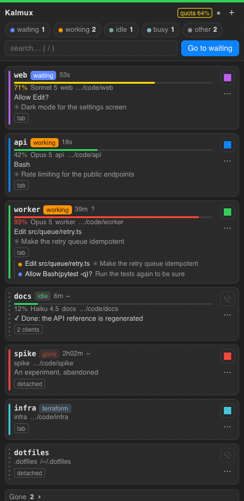

<h1 align="center">Kalmux</h1>

<p align="center">
<b>Ten Claude Code agents in tmux, one place to watch them all.</b><br> A thin management layer that lives inside iTerm2 instead of replacing your terminal.
</p>

<p align="center">


</p>

<p align="center"></p>

<p align="center"><sub>An agent stops for you, its card turns amber and jumps to the top; one click and you are in that tab. Recorded from the bundled mock server.</sub></p>

<p align="center"><a href="README.vi.md">Tiếng Việt</a></p>

---

## Why Kalera built this

A working day at [Kalera AI](https://www.kalera.ai) looks like four to ten tmux sessions, each running a Claude Code agent, each in a different repository. The agents are fast. The human is the bottleneck: one of them is waiting for an answer, one has been grinding for twenty minutes, one finished ten minutes ago and nobody noticed, and one is about to run out of context.

iTerm2 3.7 ships a Claude Code integration that answers exactly this question, and it breaks under tmux. Every pane inside a tmux server inherits the same `ITERM_SESSION_ID`, so every agent reports its state to one hidden gateway tab. The Session Status tool and Cockpit end up empty while ten agents work behind them.

Kalmux fixes the routing and then builds the missing dashboard on top of it. Nothing is replaced:

| Layer           | Stays what it is                                                            |
| --------------- | --------------------------------------------------------------------------- |
| **tmux**        | the server, so SSH and Tailscale keep working from any device               |
| **iTerm2**      | the desk client: control mode `tmux -CC`, native tabs, Cockpit, toolbelt    |
| **Claude Code** | untouched; Kalmux reads its hooks, its session registry and its status line |

Three small pieces do the work: a hook wrapper, the `kalmux` CLI, and a web UI served on `127.0.0.1:47321` that iTerm2 shows in its toolbelt.

## What you get

**One card per session, sorted by who needs you.** Waiting first, then working, idle, busy. Click a card to jump to its iTerm2 tab; if the session has no tab, one opens in the window you are in.

**A context gauge on every card.** The percentage comes straight from Claude Code's own status-line payload, so you can see which agent is about to compact before you hand it a long prompt. The card also carries the model and the session cost, and the header shows the five-hour quota window when your plan reports one.

**A `Gone` section that brings sessions back.** On 14 September 2026 an agent tidying up its own sandbox ran `tmux kill-server`. The session it ran in was itself inside tmux, so `$TMUX` pointed at the real server: four sessions, every tab, and hours of work went away in one command. Kalmux now writes a small trail for every Claude session (its id, folder, tmux pane and identity color). When a session dies, its card moves to `Gone` with a **Resume** button that recreates the tmux session in the right folder with the right color and types `claude --resume <id>` at the prompt, waiting for your Enter. The repository also carries a `CLAUDE.md` that forbids agents from ever running `tmux kill-server` again.

**Your sessions survive a reboot — and a crash.** A restart kills the tmux server and every session in it, and so does an iTerm2 crash or a force quit: iTerm2 starts the Kalmux server, the Kalmux server starts tmux, and macOS takes the whole group down together. Kalmux records the live list every five seconds together with the identity of the tmux server it came from, so as soon as a different server answers — or none does — it recreates every session that was still open: same name, same directory, same color, one tab each. `claude --continue` in a restored tab picks that directory's conversation up where it stopped.

**Identity colors that survive everything.** Twenty palette names or any hex value, stored in the tmux session itself and replayed into the iTerm2 tab on every attach, so a project keeps its color across detach, reboot and rebuild.

**Everything from the keyboard.** `Go to waiting` jumps to the first agent that needs you, `n` cycles through the rest, `1`-`9` open the nth card, `/` searches by session name, project or the title Claude gave the conversation.

**It works over SSH.** `ssh mac kalmux ls` prints the same table without iTerm2, and the tmux status line shows `[working]` / `[waiting]` per window for plain attaches.

## Install

Requires macOS with iTerm2 3.7+, tmux 3.x, Python 3.11+, `jq`, and `uv` for the toolbelt registration.

```bash
brew install kalera-labs/tap/kalmux
kalmux setup
```

Recent Homebrew asks you to vouch for a third-party tap before it will run its formula: `brew trust kalera-labs/tap`.

Or from a clone, which is also how you hack on it:

```bash
git clone https://github.com/kalera-labs/kalmux.git
cd kalmux
bin/kalmux setup
```

Either way `kalmux` ends up on your PATH: Homebrew puts the command there itself, and from a clone `setup` links `~/.local/bin/kalmux` to `bin/kalmux`.

`setup` is idempotent and reversible. It creates `~/.config/kalmux/config.toml`, links the hook and the CLI, sets two iTerm2 preferences, adds a managed block to `~/.tmux.conf`, installs an iTerm2 AutoLaunch script that starts the UI server, routes Claude Code's status line through Kalmux, registers the toolbelt tool, and finishes by running `kalmux doctor`.

Then open the toolbelt: **View > Toolbelt** (⇧⌘B) and pick **Kalmux**. Reattach your sessions once (`kalmux open <name>` per session, from a single window) so the new tab preferences apply.

<details>
<summary>What setup touches, and why</summary>

- `~/.config/iterm2/cc-status` → symlink to the hook wrapper. This is the path iTerm2 writes into `~/.claude/settings.json`. Reinstalling iTerm2's Claude Code integration can undo it; `kalmux doctor` notices and `kalmux setup` puts it back.
- `~/.local/bin/kalmux` → the CLI, when you run from a clone. `kmux` and `tm` stay as aliases to the same file, so older muscle memory and scripts keep working. An installed package already owns the name, so `setup` leaves it alone.
- iTerm2 preferences `OpenTmuxWindowsIn=2` (tmux windows open as tabs in the attaching window) and `AutoHideTmuxClientSession=true`.
- A managed block in `~/.tmux.conf`: `allow-passthrough on`, `exit-empty off` (so killing the last session does not stop the server and look like a crash), a status line that shows `[working]` / `[waiting]` per window, and a `client-attached` hook that replays state and color into a fresh tab.
- `~/Library/Application Support/iTerm2/Scripts/AutoLaunch.scpt`, which starts the UI server whenever iTerm2 launches. An AutoLaunch script you wrote yourself is never overwritten. The generated script bakes in an absolute interpreter path and a `PATH` prefix, because iTerm2 launches under the login `PATH` where neither a modern `python3` nor Homebrew's `tmux` is visible, and a server that cannot find `tmux` shows an empty toolbelt after every reboot.
- `~/.claude/settings.json` → `statusLine` is routed through `kalmux statusline`; the previous value is saved verbatim and the whole file is copied to `settings.json.bak-kalmux` (mode 0600, it can hold API keys) before the key is rewritten. Skip this step with `--no-statusline`.
- The toolbelt tool, registered through iTerm2's Python API. The API cookie is fetched through AppleScript so no permission dialog appears.

**Why iTerm2 starts the server and not launchd:** talking to iTerm2 needs an Apple Event, and the repository may live on an external volume. A launchd-spawned process has neither TCC grant (Automation, Removable Volumes) and blocks on macOS permission prompts, while anything spawned from iTerm2's own process tree inherits both.

</details>

## The command

```
kalmux ls [--json]            every session with project, Claude state, context %, age, title, color
kalmux go <topic>             focus a session by name, or by part of its project or Claude title; over SSH it attaches here
kalmux open <session>         open the session as a new control-mode tab in the current window (closes with the session)
kalmux color <session> <c>    identity color: #rrggbb, one of 20 palette names, or none
kalmux new <name> [--cwd D] [--color C] [--claude] [--no-attach]
kalmux kill | detach <session>        kalmux rename <session> <new>
kalmux dead [--all] [--json]  Claude sessions that are gone: killed first, then the clean exits
kalmux resume <id|name>       recreate the tmux session and type `claude --resume <id>` at the prompt
kalmux forget <session-id>    drop a dead session's trail
kalmux restore [--dry-run] [--no-tabs]
                              recreate the sessions that were open before the tmux server went away
kalmux attach <session>       the right verb for where you are: -CC in iTerm2, switch-client in tmux, plain over SSH
kalmux reapply [session]      re-send state and tab color to attached panes
kalmux ui show|status|start|stop|restart|install|uninstall|url|serve
kalmux config                 show the effective configuration and where it lives
kalmux statusline [install|uninstall|status]
kalmux doctor [--no-ui] [--no-statusline]
kalmux setup  [--no-ui] [--no-statusline]
```

## How it knows

No screen scraping. Every number has a source.

| Signal                         | Where it comes from                                                                                                 |
| ------------------------------ | ------------------------------------------------------------------------------------------------------------------- |
| `waiting` / `working` / `idle` | Claude Code hooks, written by the wrapper into tmux pane options (`@cc_state`, `@cc_detail`, `@cc_since`)           |
| identity and liveness          | Claude Code's session registry, `~/.claude/sessions/<pid>.json`, which maps each conversation to an exact tmux pane |
| `busy`                         | tmux's own `#{pane_current_command}`: a pane with no Claude in it that is running `make`, `pytest`, a script        |
| context %, model, cost, quota  | Claude Code's status-line payload, captured by `kalmux statusline`                                                  |
| gone sessions                  | the trail files Kalmux appends on `SessionStart`, `Stop` and `SessionEnd`                                           |
| tab identity                   | iTerm2's `tmuxWindowPane` session variable, so a tmux pane maps to exactly one tab                                  |

Two states describe trouble rather than work: `gone` means the Claude process died, `stale` means hook state left behind on a pane that no longer runs Claude. In `kalmux ls`, `~` marks a value recalled from the registry and `?` marks a session that has been working or waiting for over thirty minutes.

Dead sessions are classified `killed` (no `SessionEnd` ever arrived), `clean` (logout or exit) or `superseded` (`/clear` or a resume, hidden unless you pass `--all`). Trails and status files older than `tombstones.keep_days` are pruned automatically.

**Known blind spot:** a shell running a script of its own kind, a bash script under a bash shell, reports the shell's own name, so `busy` reads it as an empty prompt. Catching that needs a shell hook rather than a tmux format.

## Restore after a reboot or a crash

A reboot kills the tmux server and every session with it, and so does an iTerm2 crash or a force quit: AutoLaunch starts the Kalmux server, the Kalmux server starts tmux, and the three of them share one macOS resource coalition, so they go down together. That is exactly what happened here on 4 October 2026 — no reboot, no logout, half a second between iTerm2 dying and the last session going with it. Quitting iTerm2 normally does not do that: it only detaches its control-mode clients. Killing a session does not either — that is you saying so. So what Kalmux writes down is not "the sessions are gone" but which tmux server the saved list describes.

The UI server records the live sessions — name, directory, identity color, creation order — into `${KALMUX_STATE_DIR}/sessions.json` every five seconds, and immediately after any kill, rename, new or resume, together with the pid and start time of the tmux server they belong to. It writes only when something changed, and it never writes anything while no server answers: a server that is gone is a server whose sessions you did not kill. It also takes one last snapshot when it is asked to stop, if tmux is still there to answer.

`kalmux setup` puts `set -s exit-empty off` in the managed block of `~/.tmux.conf`, so killing the last session leaves the server up with an empty list instead of stopping it. Without that line the two cases are indistinguishable — the last session killed, and tmux dead — and the session you just killed would come back at the next restore. `kalmux doctor` checks for the line.

A restore is due when the saved list has sessions and the server that wrote it is not the one answering now: nothing is running (a reboot, or a tmux that died and nobody restarted it), or another server holds the socket. That is checked when the UI server starts, which covers the reboot and the crash that took Kalmux down with iTerm2, and again on every five-second round, which covers a tmux that died while the Kalmux server kept running. Either way the saved list is copied to `sessions.previous.json` first, every session that is not already there is recreated (an existing name is never stolen or renamed; a directory that has moved falls back to `$HOME` and says so), one iTerm2 tab is opened per restored session — a window first, because after a reboot there is none — and the state of the server that runs now is recorded, so nothing is restored twice. Everything it did is in `ui.log`, and `kalmux doctor` shows the snapshot's age, whether it still matches the live sessions, and whether it still belongs to a server that is gone.

A deliberate `tmux kill-server` is indistinguishable from a crash, so those sessions come back too. To drop sessions for good, end them one at a time: the UI, `kalmux kill`, `tmux kill-session`, or `exit` in the last pane.

Only name, directory and color come back: no windows, no panes, no running processes and no conversation. A restored session is a shell in the right directory, which is what `claude --continue` needs.

```bash
kalmux restore --dry-run     # what would happen: create / exists / its directory is gone -> ~
kalmux restore               # do it by hand (and `--no-tabs` to skip the iTerm2 tabs)
```

`kalmux restore` reads `sessions.json` while that file still belongs to a server that is gone, and `sessions.previous.json` once the server running now has taken the file over. It never writes the snapshot, so you can run it as often as you like. Set `enabled = false` under `[restore]` to keep the recording (and the copy) and turn only the automatic part off; a list lost that way is still a line in `ui.log`, naming the file that holds it.

## Configuration

`~/.config/kalmux/config.toml` is yours; Kalmux creates it once and never rewrites it.

```toml
[claude]
# Typed into a new session by `kalmux new --claude`.
new = "claude"
# Typed into the pane by `kalmux resume`. {session_id} is replaced with the Claude session id.
resume = "claude --resume {session_id}"
# "type" leaves the command on the prompt; "run" presses Enter for you.
resume_mode = "type"

[tombstones]
keep_days = 30

[notify]
# "auto": post the iTerm2 alert Claude Code skips inside tmux, unless you set preferredNotifChannel yourself.
iterm2 = "auto"
bell = false

[restore]
# When the tmux server that held your sessions is gone — a reboot, an iTerm2 crash, a tmux that died —
# Kalmux recreates every session that was open (same name, directory and color), each in its own tab.
# `kalmux restore` does the same by hand.
# The session list is recorded either way; this only turns the automatic restore on and off.
enabled = true
```

If you live in `--dangerously-skip-permissions`, put it in these templates once and both `new` and `resume` will follow. Changes take effect immediately; no restart.

**Notifications.** Claude Code picks its notification channel from `TERM_PROGRAM`. tmux sets that to `tmux`, so inside tmux the default `auto` channel finds no method and Claude posts nothing, while the same Claude in a plain iTerm2 tab posts a macOS notification, with its sound, the moment it needs you. That silence is the first thing people notice after moving their agents into tmux. Kalmux fills it: on the same `Notification` event the hook posts the same OSC 9 alert into the pane, and iTerm2 shows it exactly as it would have. `iterm2 = "auto"` steps aside as soon as `~/.claude.json` carries a `preferredNotifChannel` of your own (`claude config set -g preferredNotifChannel iterm2` also works inside tmux, since Claude wraps the sequence for tmux itself), `"always"` posts regardless, `"never"` turns it off, and `bell = true` adds the terminal bell, like Claude's own `iterm2_with_bell`.

**State directory:** trails, status records and the saved status line live under `$KALMUX_STATE_DIR`, default `~/.local/state/kalmux` (`XDG_STATE_HOME` is not read). If you override it, set it somewhere Claude Code, the hook and the UI server all inherit, because a file written under one value is invisible to a reader started under another.

## The status line tap

`kalmux statusline` sits in front of whatever status line you already use. It stores a normalized copy of each refresh, which is where the context gauge reads from, then passes up to 1 MiB of the payload to your original command and exits with its status, so your own prompt keeps rendering exactly as before. The overhead is about 18 ms per refresh.

Your original `statusLine` object is saved verbatim. `kalmux statusline uninstall` puts it back and renames the saved copy rather than deleting it, so installing again records whatever status line you use by then. If that saved copy disappears while the key is still routed through Kalmux, uninstall refuses instead of leaving you with no status line, and `kalmux doctor` turns red and points at the settings backup.

## Security

The server binds to loopback only. Every API call carries a per-process CSRF token minted into the page, `Host` and `Origin` are pinned to loopback, and the page runs under a nonce CSP with no inline handlers and no external resources. The token defends against web pages, not against other processes of the same user: anything that can open a loopback socket as you can also run `tmux kill-session` directly.

Status replay only ever writes to character devices under `/dev`, tmux records that do not look like tmux's own ids are dropped, and the settings backup is written 0600 because that file can hold API keys.

## Troubleshooting

`kalmux doctor` checks the config file, the hook symlink, the hook wiring in `settings.json`, `jq`, the tmux.conf block, both iTerm2 preferences, the toolbelt registration, the AutoLaunch script and its baked paths, the status-line routing, and the server: that it answers, that it runs this version of the code, and which `tmux` binary it can see.

After changing Kalmux's own code, run `kalmux ui restart` from a shell inside iTerm2, so the server keeps iTerm2's TCC grants.

**A restart that never happens.** iTerm2 asks "Quit iTerm2?" when something tells it to quit, and macOS waits for that dialog during a restart: the machine sits there until you answer, and if you walked away it is still sitting there when you come back. The sessions are safe either way — iTerm2 only detaches its tmux clients — but nothing restarts. Lift it with `defaults write com.googlecode.iterm2 NeverBlockSystemShutdown -bool true` (Kalmux never changes this preference for you). The confirmation then only applies to a Cmd-Q you typed yourself.

## Development

```bash
uv run --no-project --with pytest --with pytest-cov python -m pytest -q --cov=src/kalmux --cov-report=term-missing
uvx ruff check .
python3 scripts/dev/mock_server.py 47399    # the UI with fake data at http://127.0.0.1:47399/
kalmux ui restart                           # after changing server code, from a shell inside iTerm2
```

Python standard library only, no runtime dependencies. `src/kalmux/` holds the modules, `src/kalmux/assets/` the hook wrapper and the single-file front end, `bin/kalmux` runs the whole thing straight from a clone.

## License

MIT. Made by [Kalera AI](https://www.kalera.ai).
